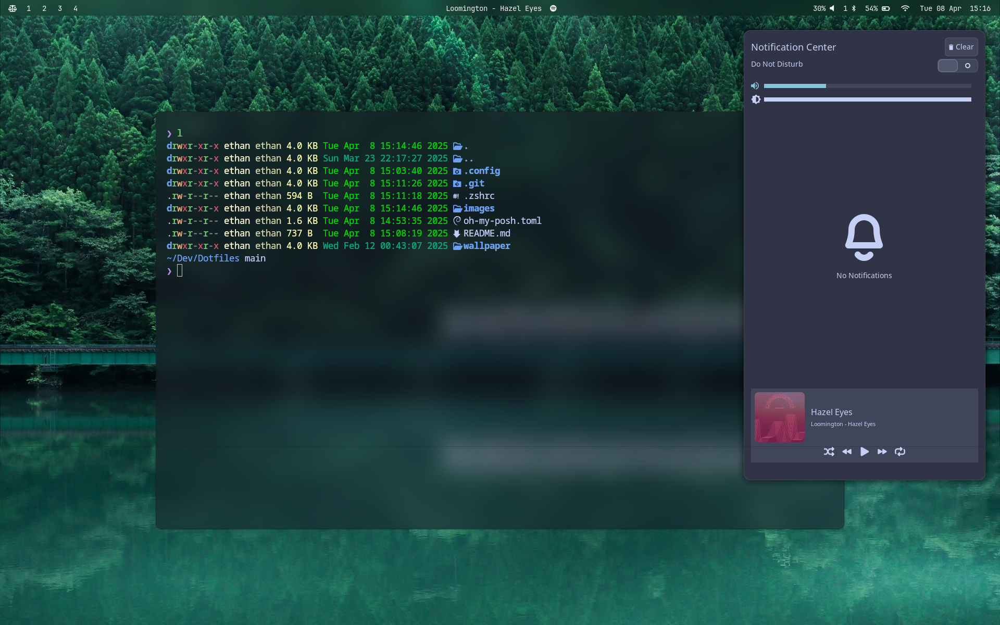

# Dotfiles



# For arch and arch base distro
```
yay -S hyprland hyprlang hyprshot-git hyprlock neovim cava dunst kitty waybar wofi rofi otf-font-awesome lsd wlogout --noconfirm zsh waypaper swww brightnessctl ttf-jetbrains-mono-nerd whitesur-gtk-theme xdg-desktop-portal-hyprland xdg-desktop-portal-gtk swaync
```

# Clone this repo in your computer
```
git clone https://github.com/Ethanlsbr/Dotfiles.git
cd Dotfiles
cp -r .config/. ~/.config/
```

# If you want the same shell prompt
```
cp .zshrc ~/.
cp oh-my-posh.toml ~/.config
git clone https://github.com/zsh-users/zsh-autosuggestions ~/.zsh/
git clone https://github.com/zsh-users/zsh-completions ~/.zsh/
git clone https://github.com/zsh-users/zsh-syntax-highlighting ~/.zsh/
```