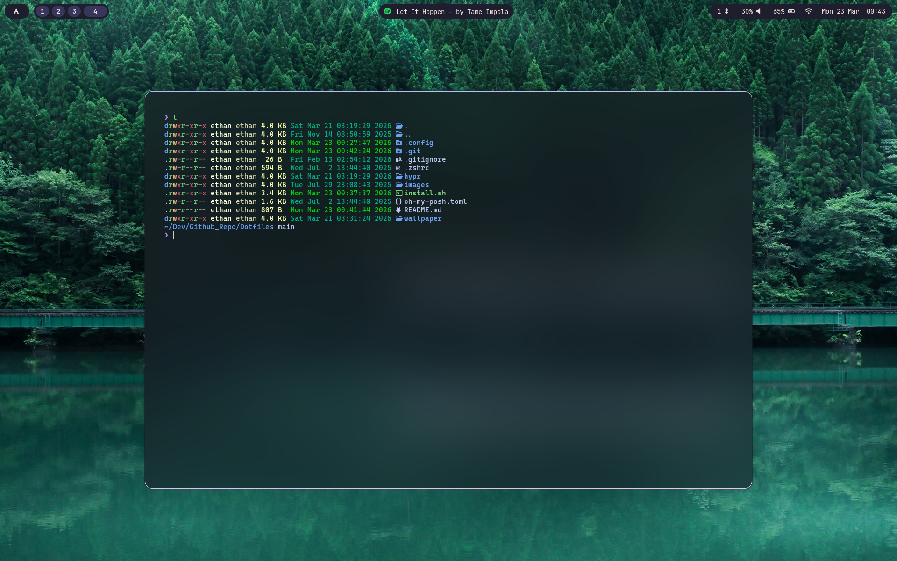

# Dotfiles



# For arch and arch base distro
```
yay -S hyprland hyprlang hyprshot hyprlock cava dunst kitty swaylock-effects waybar rofi otf-font-awesome lsd wlogout zsh waypaper swww brightnessctl ttf-jetbrains-mono-nerd ttf-cascadia-code-nerd whitesur-gtk-theme xdg-desktop-portal-hyprland xdg-desktop-portal-gtk swaync nwg-look oh-my-posh btop blueman hypridle wl-cliphist wl-clip-persist --noconfirm --needed
```

# Clone this repo in your computer
```
git clone https://github.com/Ethanlsbr/Dotfiles.git
cd Dotfiles
cp -r .config/. ~/.config/
```

# If you want the same shell prompt
```
cp .zshrc ~/.
cp oh-my-posh.toml ~/.config
git clone https://github.com/zsh-users/zsh-autosuggestions ~/.zsh/
git clone https://github.com/zsh-users/zsh-completions ~/.zsh/
git clone https://github.com/zsh-users/zsh-syntax-highlighting ~/.zsh/
```

# What i use
**Operating System** - [EndeavourOS](https://endeavouros.com/)

**Window Manager** - [Hyprland](https://hypr.land/)

**App Launcher** - [Rofi](https://github.com/davatorium/rofi)

**Text Editor** - [Neovim](https://neovim.io/) / [Vscode](https://code.visualstudio.com/)

**Status Bar** - [Waybar](https://github.com/Alexays/Waybar)

**Terminal** - [Kitty](https://sw.kovidgoyal.net/kitty/)

**Notifications Panel** - [Swaync](https://github.com/ErikReider/SwayNotificationCenter)

**Wallpaper** - [Waypaper](https://github.com/anufrievroman/waypaper)
